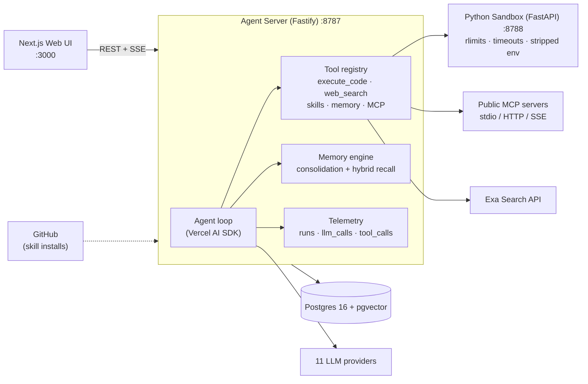

# Self-Hosted Hyperagent

A self-hosted, multi-provider AI agent platform that runs entirely on your machine with your own API keys — no auth, no billing, no external dependencies beyond the model providers you choose.

**What you get:**

- 💬 **Streaming chat with 11 LLM providers** — Anthropic, OpenAI, Google Gemini, xAI, DeepSeek, Mistral, Kimi (Moonshot), Z.ai (GLM), Qwen, Groq, OpenRouter — pick any model per thread, or type a custom model id
- 🔌 **Any public MCP server** — stdio (`npx`/`uvx`), Streamable HTTP, or SSE, with automatic tool discovery and encrypted credentials
- 🧰 **Any public Agent Skill** — install SKILL.md skills straight from GitHub (anthropics/skills, skills.sh) with progressive disclosure
- 🔍 **Exa web search** — search, page contents, and find-similar tools with citation cards in chat
- 🧠 **Long-term memory** — a knowledge graph with consolidation (dedupe / supersede / link) and hybrid vector + keyword recall injected into every turn
- 📊 **Built-in observability** — tokens, estimated costs, latency percentiles, per-run trace waterfalls, and opt-in LLM-powered conversation insights
- 🐍 **Isolated code sandbox** — the agent runs Python/Bash with resource limits, timeouts, and a stripped environment
- 🔐 **Keys encrypted at rest** — AES-256-GCM under your `APP_SECRET`; environment variables always take precedence

## Architecture



## Setup

### Run everything with Docker (recommended)

```bash
git clone https://github.com/sundaram2021/self-hosted-hyperagent.git
cd self-hosted-hyperagent
cp .env.example .env        # set APP_SECRET (openssl rand -hex 32) + the provider keys you use
docker compose -f docker-compose.prod.yml up -d --build
```

Open **http://localhost:3000**, add provider keys in Settings (or via `.env`), create a thread, and chat. Database migrations run automatically.

### Local development

Prerequisites: Node ≥ 22 with [pnpm](https://pnpm.io) ≥ 10, [uv](https://docs.astral.sh/uv/), Docker.

```bash
docker compose up -d postgres                      # infra only
cp .env.example .env
pnpm install && pnpm dev                           # web :3000 + agent server :8787

# in a second terminal — the code sandbox
cd apps/sandbox && uv sync
uv run uvicorn app.main:app --port 8788 --reload
```

Useful commands: `pnpm build` · `pnpm test` · `pnpm lint` · `pnpm typecheck` · `cd apps/sandbox && uv run pytest`

> **Security note:** there is no authentication in v1 — services bind to `127.0.0.1`. For reverse-proxy setups, backups, upgrades, MCP-in-Docker, and troubleshooting, see **[SELF_HOSTING.md](./SELF_HOSTING.md)**.
